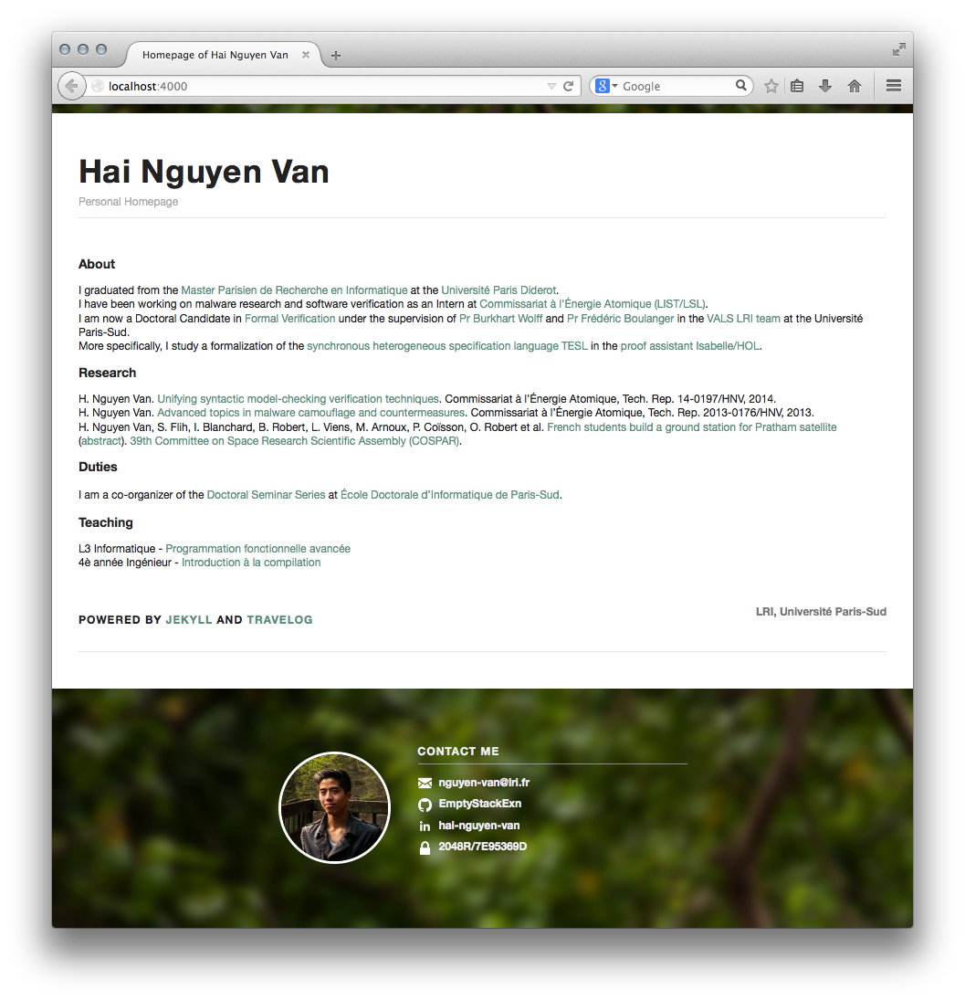

Personal homepage
=============

> A fork of Travelog theme for [Jekyll](http://jekyllrb.com/) that is both elegant and downright simple. Redesigned to fit with homepages and not blogs anymore. Forked from [rowanoulton/travelog-theme](https://github.com/rowanoulton/travelog-theme).

Usage
------------

### Content
Main changes are meant to be made in `_posts/2014-08-12-main.markdown`. Footers and headers in `_includes/`. Jekyll finally compiles into `_site`.

### Releasing
  1. The website comes with a web analytics logger in PHP. Logs are recorded in XML-like format, whose file path must be specified in `index.html`.
  2. Then, `make update` will rename it to PHP extension and upload files to a remote server, whose address must be specified in `Makefile`.

License
------------

[MIT](https://github.com/rowanoulton/travelog-theme/blob/master/LICENSE)

All credits to [@rowanoulton](https://twitter.com/rowanoulton/).

